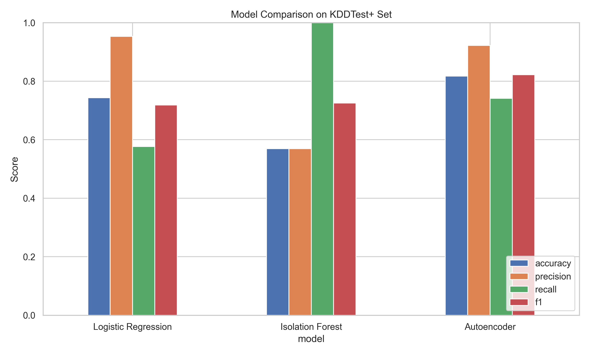

# Anomaly Detection Model Comparison – NSL-KDD Dataset

This report summarizes the performance of three anomaly detection models trained and evaluated on the NSL-KDD dataset:  

- **Logistic Regression** (Supervised baseline)  
- **Isolation Forest** (Unsupervised anomaly detector)  
- **Autoencoder** (Deep learning anomaly detection based on reconstruction error)

All models were evaluated on the official `KDDTest+` split using a consistent preprocessing pipeline.

---

## Evaluation Metrics

| Metric     | Logistic Regression | Isolation Forest | Autoencoder |
|------------|---------------------|------------------|-------------|
| Accuracy   | 0.743               | 0.569            | 0.817       |
| Precision  | 0.953               | 0.569            | 0.922       |
| Recall     | 0.577               | 1.000            | 0.742       |
| F1 Score   | 0.719               | 0.725            | 0.822       |

---

## Visual Comparison

  
*A side-by-side comparison of key metrics across models.*

---

## Key Takeaways

- The **Autoencoder** achieved the highest accuracy and F1 score on the external test set, suggesting strong generalization to unseen data.
- **Logistic Regression** served as a simple and interpretable supervised baseline, but required labeled training data.
- **Isolation Forest** offered a label-free alternative, though performance was more sensitive to contamination settings and feature representation.

---

## Evaluation Strategy

All models were evaluated using the following consistent steps:

- Preprocessing: Categorical encoding, normalization, feature selection
- Train/test split: Training on `KDDTrain+`, evaluation on `KDDTest+`
- Metrics: Accuracy, Precision, Recall, F1 Score
- Autoencoder: Threshold selected via F1-optimized Precision-Recall curve

---

## Artifacts

| Artifact              | Path                             |
|-----------------------|----------------------------------|
| Preprocessing Pipeline | `src/data_prep.py`               |
| Model Training Scripts | `src/modeling.py`, `src/experiments.py` |
| Best Autoencoder Model | `models/autoencoder_best.h5`     |
| Evaluation Notebook    | `notebooks/05_summary.ipynb`     |
| Summary Report         | `reports/model_comparison_summary.md` |

---

## Reflections

This project illustrates how different modeling strategies perform under the same conditions. 
The deep learning approach (autoencoder) proved particularly effective for anomaly detection 
when trained exclusively on normal examples and evaluated using reconstruction error. 
Threshold tuning based on the PR curve was critical to performance.

---
